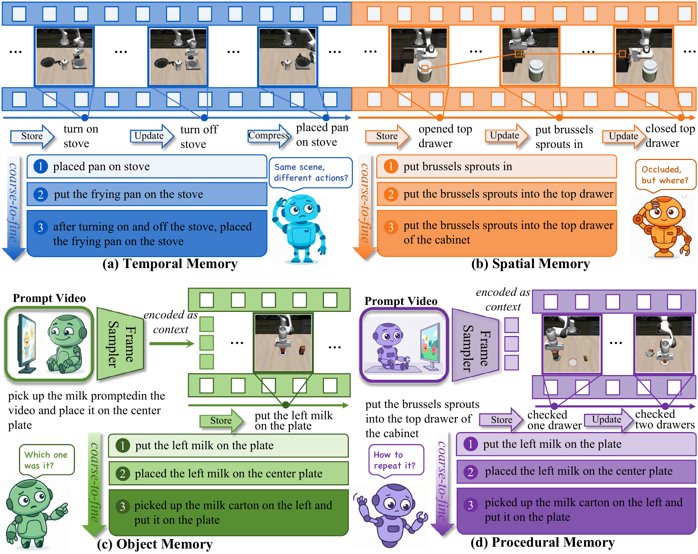

<h1 align="center">MEMOBench</h1>

  

## Introduction

MEMOBench is a process-level memory benchmark for robotic manipulation. It annotates 30 history-dependent tasks with 4,200 executable checkpoints labeling three memory operations: Storage, Update, and Compression. Evaluations show leading VLA policies store information well but fail to update and compress it, reaching only 31.9% average success.

## Dataset & object assets

Both are available at [HuggingFace](https://huggingface.co/datasets/SunSeaLucky/MEMOBench).

## License

MEMOBench is licensed under [CC BY-NC 4.0](https://creativecommons.org/licenses/by-nc/4.0/) (see [LICENSE](LICENSE)): free for non-commercial scientific research with attribution; commercial use is not permitted. Third-party code under `src/third_party/` (e.g., LIBERO) remains under its own license (MIT).